<div align="center">
    <a href="https://discord.com" target="_blank" rel="nofollow">
        <picture>
          <source media="(prefers-color-scheme: dark)" srcset="https://cdn.prod.website-files.com/6257adef93867e50d84d30e2/636e0b5493894cf60b300587_full_logo_white_RGB.svg">
          
        </picture>
    </a>
</div>
<br>
<p align="center">
    <a href="https://github.com/berkanumutlu/discord-clone/releases/tag/v0.1.0" target="_blank" rel="nofollow"></a>
    <a href="https://github.com/berkanumutlu/discord-clone/stargazers" rel="nofollow"></a>
    <a href="https://nextjs.org/docs/14" target="_blank" rel="nofollow"></a>
    <a href="https://nodejs.org" target="_blank" rel="nofollow"></a>
    <a href="https://18.react.dev" target="_blank" rel="nofollow"></a>
    <a href="https://tailwindcss.com" target="_blank" rel="nofollow"></a>
    <a href="https://ui.shadcn.com" target="_blank" rel="nofollow"></a>
    <a href="https://www.prisma.io" target="_blank" rel="nofollow"></a>
    <a href="https://www.postgresql.org/docs/release/15.7" target="_blank" rel="nofollow"></a>
    <a href="https://clerk.com" target="_blank" rel="nofollow"></a>
    <a href="https://uploadthing.com" target="_blank" rel="nofollow"></a>
    <a href="https://socket.io" target="_blank" rel="nofollow"></a>
    <a href="https://livekit.io" target="_blank" rel="nofollow"></a>
    <a href="https://missiveapp.com/open/emoji-mart" target="_blank" rel="nofollow"></a>
    <a href="https://www.npmjs.com" target="_blank" rel="nofollow"></a>
    <a href="https://www.docker.com" target="_blank" rel="nofollow"></a>
</p>

# Discord Clone

It is a study project based on Discord app built with Next.js 14, React, Tailwind, shadcn/ui, Clerk, uploadthing, Prisma, PostgreSQL, Socket.io, LiveKit.

## Features

- Designed using tailwind & shadcn
- Automatic / Light / Dark theme modes
- ORM using Prisma
- PostgreSQL database
- Authentication with Clerk
- Real-time messaging using Socket.io
- Server creation & customization
- Invite system with unique invite link generation
- Create Text, Audio chat channels
- Member management (Kick, User role change Guest / Moderator)
- Send attachments as messages using UploadThing
- Delete & Edit messages in real time for all users
- Infinite loading for messages in batches of 15 with @tanstack/query
- 1:1 conversation and audio calls between members
- Websocket fallback: Polling with alerts

## Installation

**1)** Clone repository

```shell
$ git clone https://github.com/berkanumutlu/discord-clone.git
```

Or with SSH

```shell
$ git clone git@github.com:berkanumutlu/discord-clone.git
```

Or with Github CLI

```shell
$ git clone gh repo clone berkanumutlu/discord-clone
```

**2)** Copy the example.env file and **make the required configuration changes** in the file

```shell
$ cp .env.example .env
```

**3)** Install docker container (required docker)

```shell
$ docker-compose up -d
```

**4)** After installation, find your app's container id on docker

```shell
$ docker ps

# Output:
CONTAINER ID   IMAGE                 COMMAND                  CREATED      STATUS          PORTS                              NAMES
...
4e98c27c070a   discord-clone-app     "docker-entrypoint.s…"   7 days ago   Up 15 seconds   0.0.0.0:3000->3000/tcp, 5555/tcp   discord-clone-app
...
```

- And connect to the terminal of your app's container

```shell
$ docker exec -it {APP_CONTAINER_ID} bash
```

**5)** Install all the dependencies using npm

```shell
/user/local/app $ npm install
```

**6)** Setup Prisma

```shell
/user/local/app $ npx prisma generate
/user/local/app $ npx prisma db push
```

**7)** Restart your docker container

```shell
$ docker-compose restart
```

**8)** Now you're ready to use project

- To stop the Docker container, use the following command

```shell
$ docker-compose stop
```

## Screenshots

- Home Page
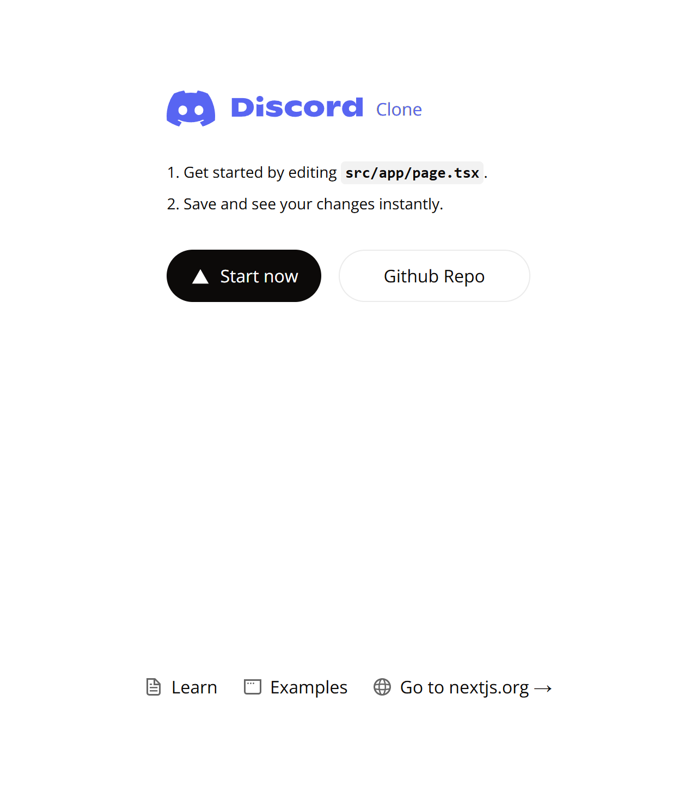 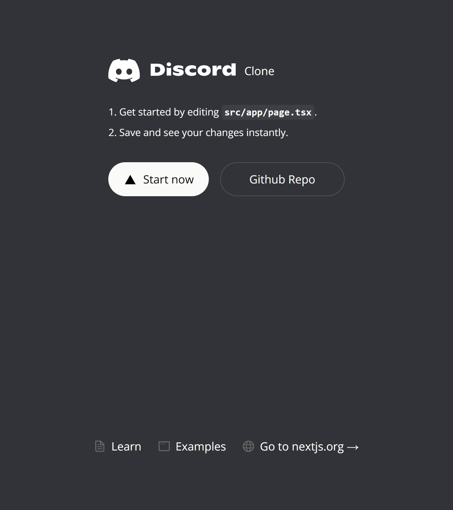
- Login page & Initial page
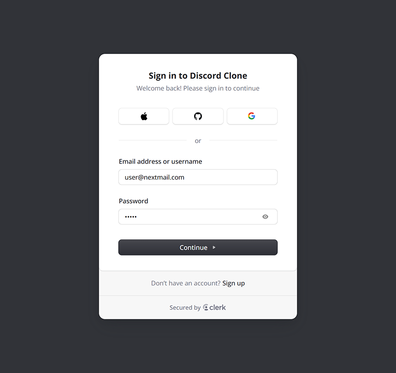 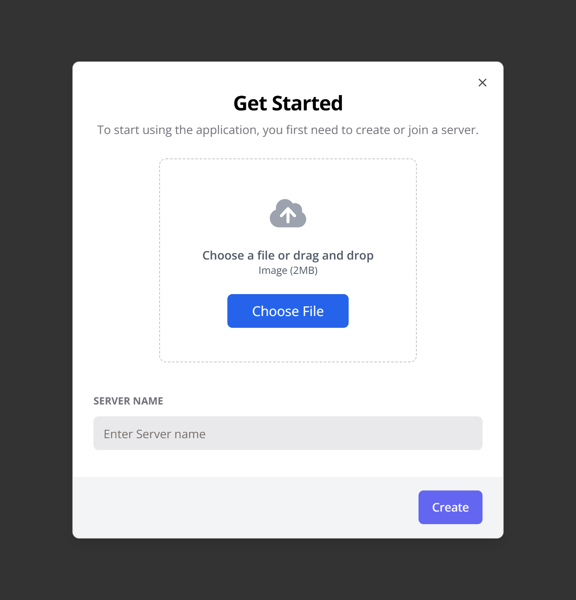
- Text channel
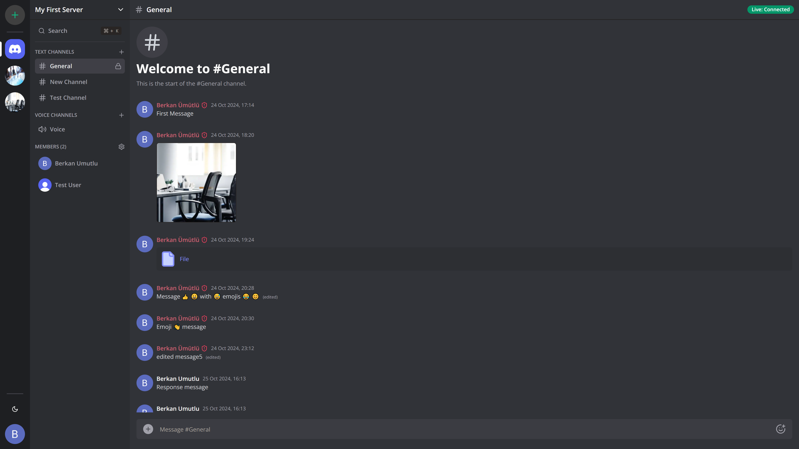 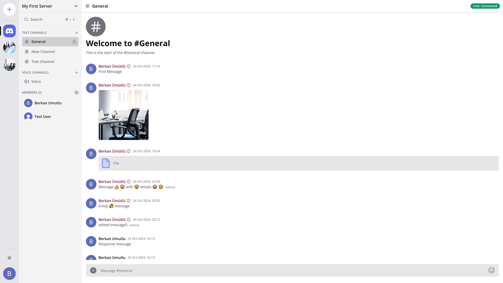
- Voice chat
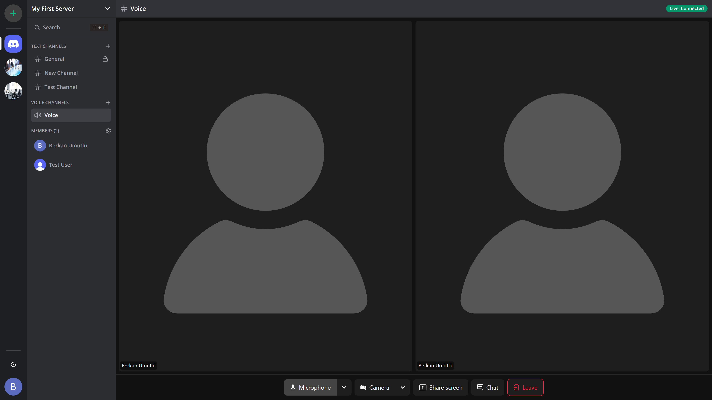
- Create server
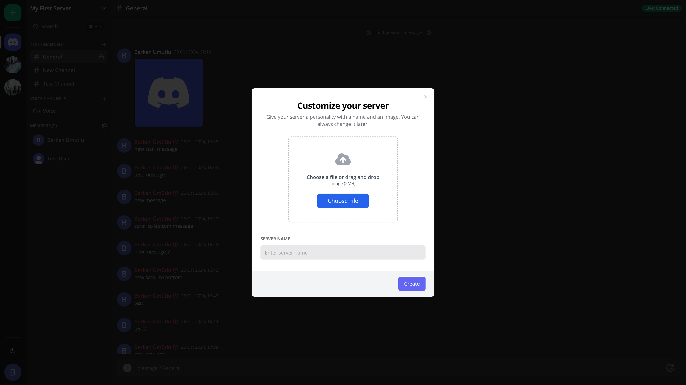
- Create channel
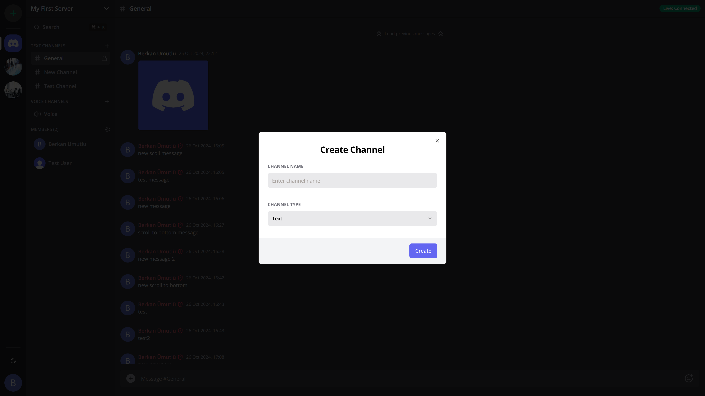
- Invite to server
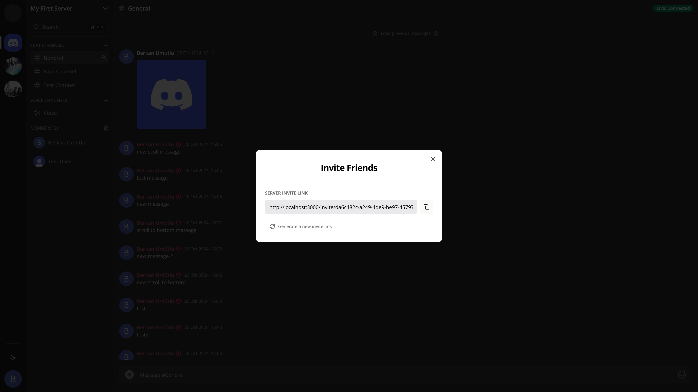
- Manage server members
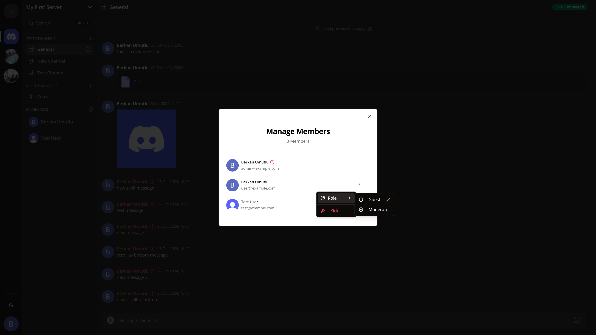
- Search in server
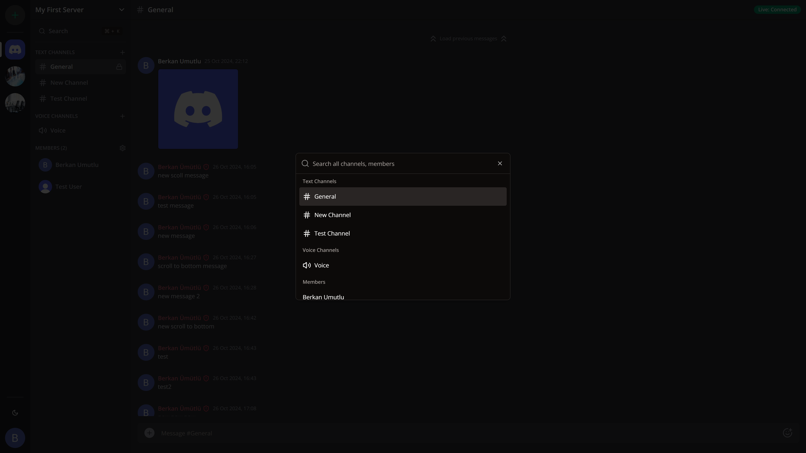
- User conversations
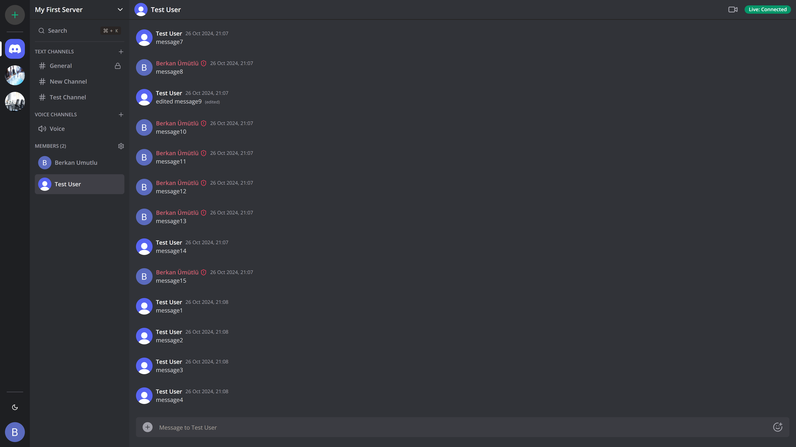

## License

This is a study project based on Discord app so they own the licence.